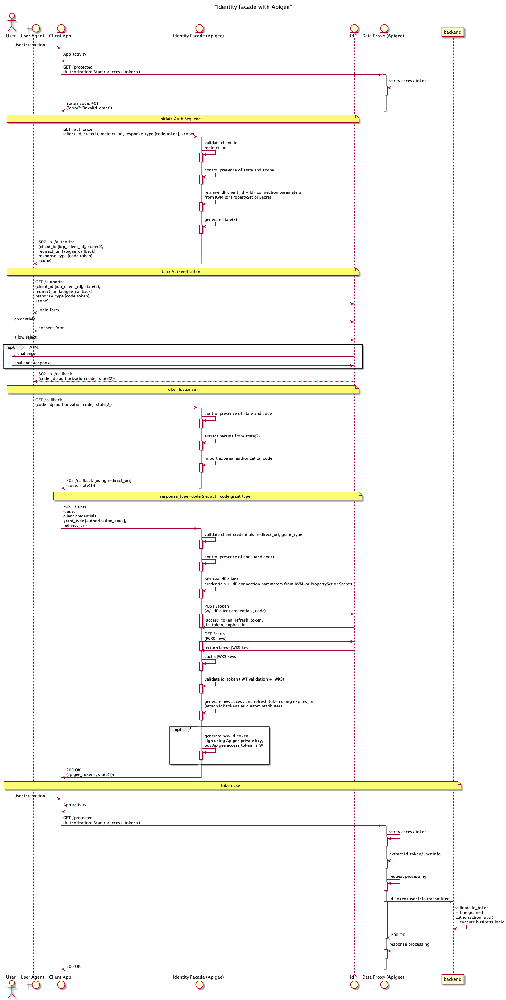

# Identity Facade

An identity facade that is used in front of an OpenID Connect (OIDC) compliant
Identity Provider (IdP).
The aim of the identity facade is to deal with all the interactions between a
client app and an IdP and to generate an OAuth 2.0 access token that
can be used by the client app to access protected resources through Apigee.
This reference promotes a clear **separation of concerns** between Apigee and
the IdP.

- Apigee is responsible for **authenticating client apps**
- The IdP is in charge of **authenticating the end-users**

The IdP that is used is the [OIDC Mock IdP](../oidc-mock) but you may
use any OIDC compliant IdP. Should you use your own IdP solution, please
provide the following environment variables to the pipeline.sh script:

- `TEST_IDP_DISCOVERY_DOCUMENT`: this variable MUST point to the URL of the
discovery document of your IdP solution.
- `TEST_IDP_APIGEE_CLIENT_ID`: the client_id Apigee can use to connect to
 the IdP
- `TEST_IDP_APIGEE_CLIENT_SECRET`: the client_secret Apigee can use to
connect to the IdP

## Dependencies

- [Maven](https://maven.apache.org/)
- [NodeJS](https://nodejs.org/en/) LTS version or above
- Apigee Evaluation [Organization](https://login.apigee.com/sign__up)
- [OIDC Mock IdP](../oidc-mock)

## Quick start

### Apigee X / hybrid

    export APIGEE_X_ORG=xxx
    export APIGEE_X_ENV=xxx
    export APIGEE_X_HOSTNAME=api.example.com

    ./pipeline.sh --googleapi

### Apigee Edge

    export APIGEE_ORG=xxx
    export APIGEE_ENV=xxx
    export APIGEE_USER=xxx
    export APIGEE_PASS=xxx

    ./pipeline.sh --apigeeapi

## Script outputs

The pipeline script deploys on Apigee an API Proxy containing the full
configuration of the identity facade reference as well as the
following elements:

- the [OIDC Mock IdP](../oidc-mock/README.md) reference
- A Key Value Map (`idpConfigIdentityProxy`) with values inherited from
the IdP's discovery document. This KVM is scoped at env level.
- A cache (`IDP_JWKS_CACHE`) used to cache JWKS keys received from
the IdP. This cache is scoped at env level.
- An API Product only used for functional tests
- A developer app only used for functional tests

On the machine and directory from where the script is executed, you can find
a `edge.json` file, which contains the configuration of all these
elements

## Identity Facade Sequence Diagram

The sequence diagram providing all the interactions between end-user,
web-browser, client app, Apigee (identity facade and data proxy), IdP and
backend is available as a [text file](./diagram/sequence-identity-facade-v1.txt)
If needed, you can modify this file and re-generate the related picture (png)
using the following command:

    ./generate_docs.sh

Here is the orginal sequence diagram:

### Indentity Facade Endpoints

Available endpoints are the following ones:

1. GET /authorize: to deal with the initiation of the authentication sequence
2. GET /callback: to deal with access token issuance
3. POST /token: to deal with access token issuance
4. GET /protected: to simulate access to a protected resource
